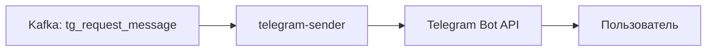
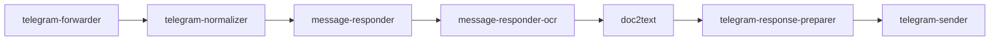

## О приложении

telegram-sender читает подготовленные `SendMessageRequest` из Kafka и вызывает Telegram Bot API (`sendMessage`). Он отвечает за финальную доставку текста пользователю, обрабатывает HTTP‑коды Telegram и перезапускает консьюмера при сбоях.

## Роль приложения в архитектуре проекта

Это последний элемент Telegram‑ветки:


Все вышестоящие сервисы формируют сообщение в виде `{chat_id, text}`, а sender преобразует его в реальный HTTPS‑запрос к `https://api.telegram.org/bot<TOKEN>/sendMessage`.

## Локальный запуск

1. Требования: Go ≥ 1.24, доступ к Kafka и действующий токен Telegram Bot API.
2. Экспортируйте переменные:
   - Kafka: `KAFKA_BOOTSTRAP_SERVERS_VALUE`, `KAFKA_TOPIC_NAME_TG_REQUEST_MESSAGE`, `KAFKA_GROUP_ID_TELEGRAM_SENDER`, `KAFKA_CLIENT_ID_TELEGRAM_SENDER`, опционально `KAFKA_SASL_USERNAME`/`KAFKA_SASL_PASSWORD`.
   - Telegram: `TELEGRAM_TOKEN`.
3. Запустите компонент:
   ```bash
   go run ./cmd/tg-sender
   ```
   или соберите контейнер `docker build -t telegram-sender .`.
4. Проверьте логи: успешные отправки появляются с `✅`, ошибки приводят к retry‑циклу `runConsumerSupervisor`. Убедитесь, что `telegram-response-preparer` публикует сообщения в `KAFKA_TOPIC_NAME_TG_REQUEST_MESSAGE`.
